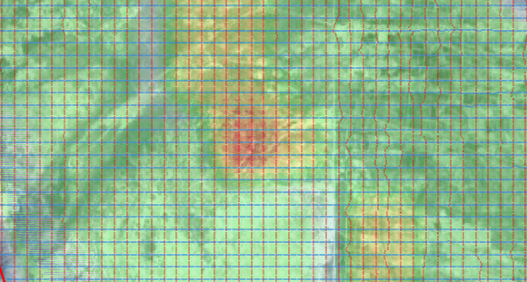

# Seismic binning - fold plot

* bins.py - create database, create bins and store bins in the database 
* binning.py - read sps files (R,S, X), create traces and store traces in the database

Bins and traces are stored in a SQLite database. Actual binning is done using the following query:
```
update bins set bin_count = ifnull(bin_count, 0) + bc from 
	(select bin_sp, bin_rp, count(*) as bc 
		from traces tr where tr.offset > 0 and tr.offset < 4500 group by tr.bin_sp, tr.bin_rp
	) as bins_grouped
	where bins.bin_sp = bins_grouped.bin_sp and bins.bin_rp = bins_grouped.bin_rp;
```
QGIS fold plot is shown below for offset 0 - 1500 meter.




